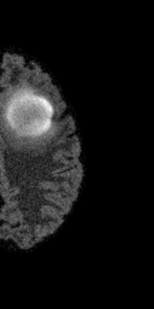
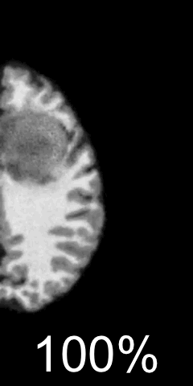
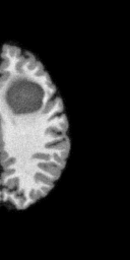
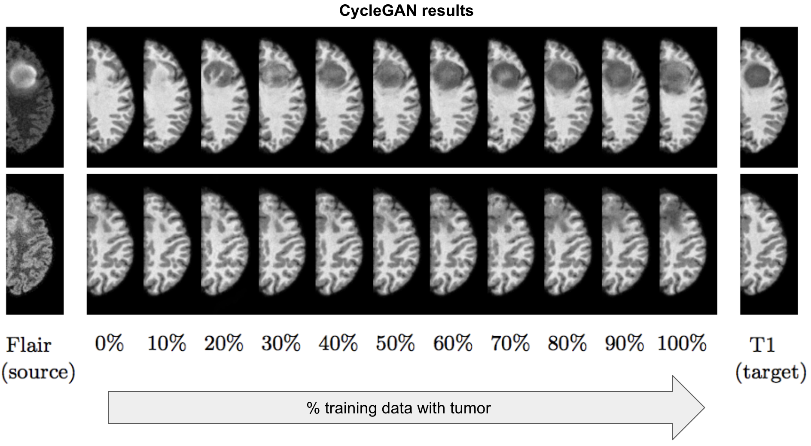

# Distribution Matching Losses Can Hallucinate Features in Medical Image Translation

https://arxiv.org/abs/1805.08841





## How to run

Prepare the data

[prepare_data.ipynb](prepare_data.ipynb)


Run the cyclegan for each split

```
$sh ...sh
```

Normalize the data to train the classifier

```
$sh ...sh
```

Train the classifier and classify images:

[prepare_data.ipynb](train_classifier.ipynb)





## Requirements

If you want to use Conda:

```
conda create -n pytorch python=3 numpy scipy pandas scikit-learn
source activate pytorch
conda install pytorch torchvision cuda80 -c soumith
```

